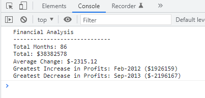

<!-- Improved compatibility of back to top link: See: https://github.com/othneildrew/Best-README-Template/pull/73 -->

<!--
*** Thanks for checking out the Best-README-Template. If you have a suggestion
*** that would make this better, please fork the repo and create a pull request
*** or simply open an issue with the tag "enhancement".
*** Don't forget to give the project a star!
*** Thanks again! Now go create something AMAZING! :D
-->
 

# Console Finances

<!-- ABOUT THE PROJECT -->
## About The Project

This is analysis of a simple dataset displayed in the console. The goal of this project was to demonstrate basic grasp of Javascript and capacity for research by finding a solution.

## Installation

N/A

<!-- USAGE EXAMPLES -->
## Usage

Follow this link to the deployed page:
, open the console with Ctrl + Shift + J or by right click > Inspect > Console tab and the financial analysis will be displayed in the console.

<!-- ACKNOWLEDGMENTS -->
## Acknowledgments

* [Best README Template](https://github.com/othneildrew/Best-README-Template/pull/73)
